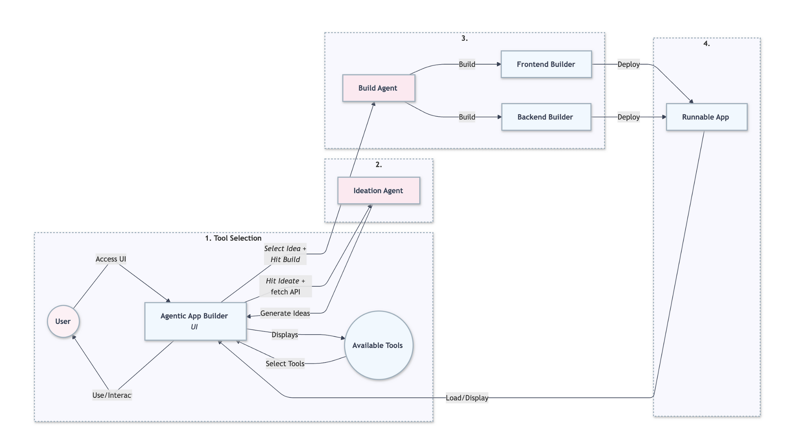
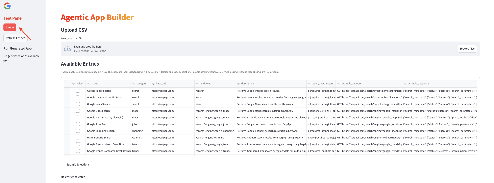
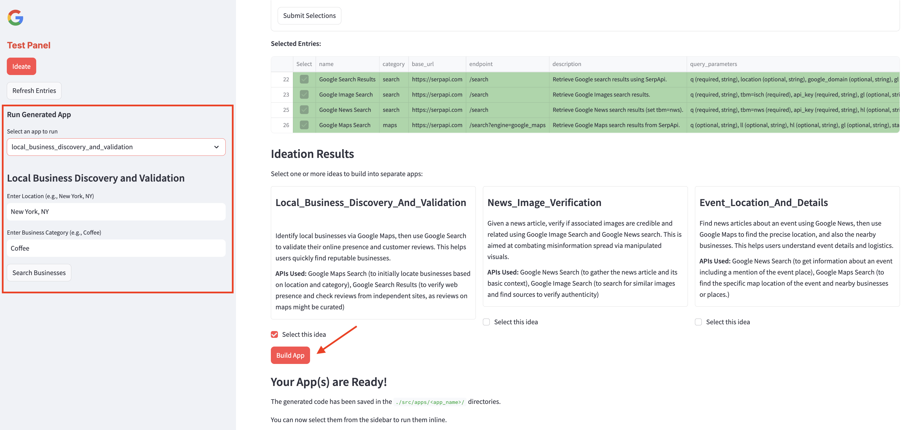
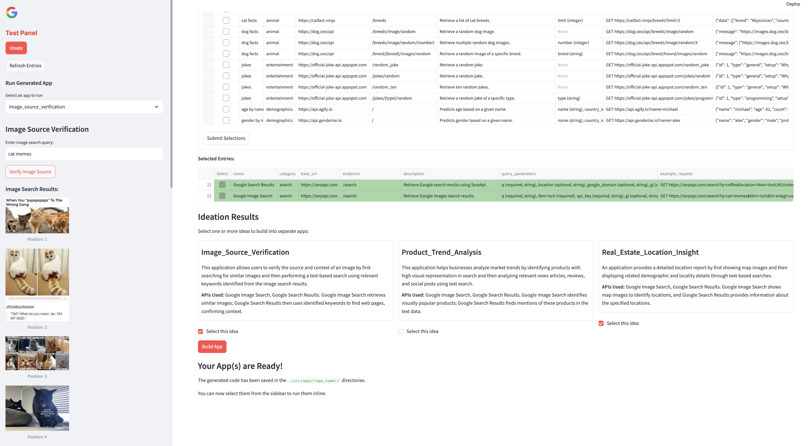
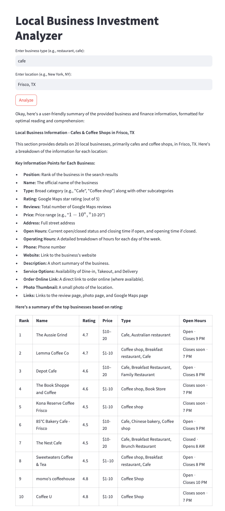
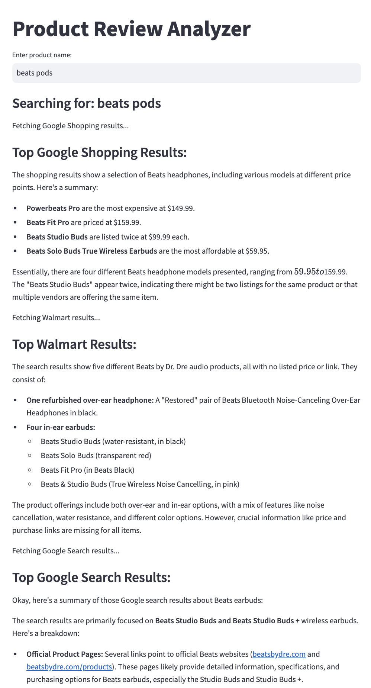
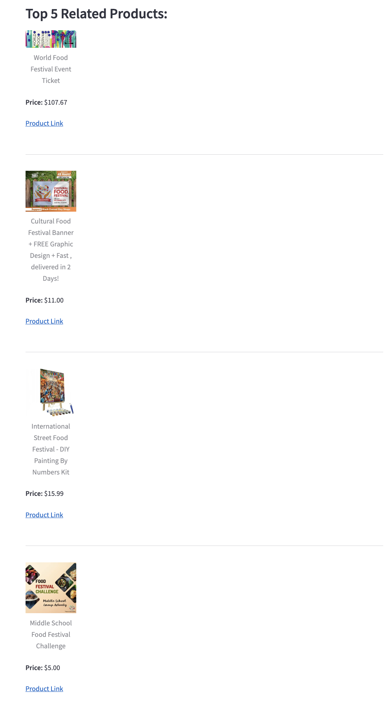

# AgenticAppBuilder

**A multi-agent workflow that lets you ideate and construct lightweight web applications, leveraging a curated set of public APIs, powered by Google Cloud Platform and Gemini.**


## Overview

AgenticAppBuilder is an agentic setup designed to dynamically create lightweight web (Streamlit) applications through multi-agent collaboration. Leveraging Google Cloud Platform (GCP) and Gemini's advanced generative AI capabilities, the tool can help you intelligently ideate, delegate tasks, and seamlessly integrate APIs to deliver rapid and efficient application development. The system includes a curated API library with preselected APIs and offers an extensible design that allows easy integration of additional APIs or extension of agent capabilities to suit specific needs.

<div align="center">
  
  <p><strong>Click on the image to enlarge</strong></p>
</div>

## Getting Started

#### Prerequisites

- **Python** 3.8 or higher

#### Getting API Keys

To utilize certain features, you'll need API keys from Gemini and SerpApi.

#### Gemini API Key

1. **Sign in to your Google Account**: Ensure you're logged in to your Google account.

2. **Access Google AI Studio**: Navigate to [Google AI Studio](https://ai.google.dev/aistudio).

3. **Obtain API Key**:
   - Click on the **"Gemini API"** tab.
   - Click the **"Get API Key in Google AI Studio"** button.
   - Review and accept the terms of service.
   - Choose to create the API key in a new or existing project.
   - Your API key will be generated; store it securely.

For detailed instructions, refer to [Google's official guide](https://ai.google.dev/gemini-api/docs/api-key).

#### SerpApi API Key

1. **Create an Account**: Sign up at [SerpApi](https://serpapi.com/users/sign_up).

2. **Access Dashboard**: After logging in, go to the [dashboard](https://serpapi.com/dashboard).

3. **Retrieve API Key**: Your private API key is displayed in the **"Your Private API Key"** section. Copy and store it securely.

For more information, visit [SerpApi's documentation](https://serpapi.com/search-api).

### Installation

1. **Clone the Repository**:
   ```bash
   git clone https://github.com/arunpshankar/AgenticAppBuilder.git
   cd AgenticAppBuilder
   ```

2. **Create and Activate a Virtual Environment**:
   - **Create**:
     ```bash
     python -m venv venv
     ```
   - **Activate**:
     - **Windows**:
       ```bash
       venv\Scripts\activate
       ```
     - **macOS and Linux**:
       ```bash
       source venv/bin/activate
       ```

3. **Upgrade pip**:
   ```bash
   pip install --upgrade pip
   ```

4. **Install Dependencies**:
   ```bash
   pip install -r requirements.txt
   ```

5. **Set Environment Variables**:
   ```bash
   export PYTHONDONTWRITEBYTECODE=1 PYTHONPATH=$PYTHONPATH:.
   ```

6. **Configure API Keys**:
   - Create a folder named `credentials` inside the cloned project:
     ```bash
     mkdir credentials
     ```
   - Inside the `credentials` folder, create a YAML file named `api.yml` with the following content:
     ```yaml
     GOOGLE_API_KEY: your_gemini_api_key
     SERP_API_KEY: your_serpapi_api_key
     ```
   Replace `your_gemini_api_key` and `your_serpapi_api_key` with the API keys you obtained earlier.

7. **Run the Application**:
   ```bash
   streamlit run src/workflow/app.py
   ```

By following these steps, you'll set up the AgenticAppBuilder project with the necessary configurations and API integrations. 


### User Interface 

how to get started with the UI

thisis landing page where you get started
the system preloads all apis and related info needed
api indivudal is a tool here equivalnt 
we need to click on ideate 


hititing this button ideate randomly picks 3 to 4 apis (tools) here and trigers ideautin agent that makes use of the selectons and starts ideationing on ideas 
the ideas are displayed in the imaef brlow 


we can then select on oneor more of the ideas and hit build 
this kicks of the app builing ptrocess 
builder agent takes over and starts building the frontend and backend of the wen app (stealit)
buildree for each app it is buiding it knows the combinaions of apis (tools) ot needsto use and how to put it together right order 
ensuring frontend leverages thebackedn 


here is an other example 


the apps after built are deployed to localhost and will start showing in the side panel 
the app can also be opened in full screen 

$ streamlit run ./src/apps/<app_name>frontend.py


## Example Runs 

lets look at some of the apps created by agents 











## Contributing

Contributions are welcome! Please follow these steps:

1. Fork the repository.
2. Create a new branch: `git checkout -b feature-name`.
3. Commit your changes: `git commit -m 'Add new feature'`.
4. Push to the branch: `git push origin feature-name`.
5. Submit a pull request.

## License

This project is licensed under the MIT License - see the [LICENSE](LICENSE) file for details.

## Contact

For queries or collaborations, please contact [Your Name](mailto:arunpshankar@google.com).


