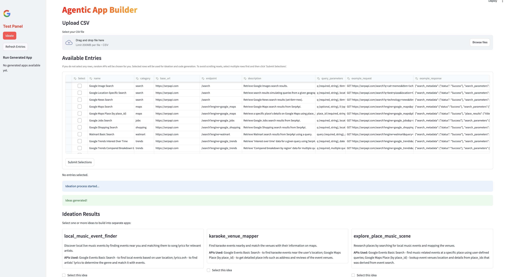
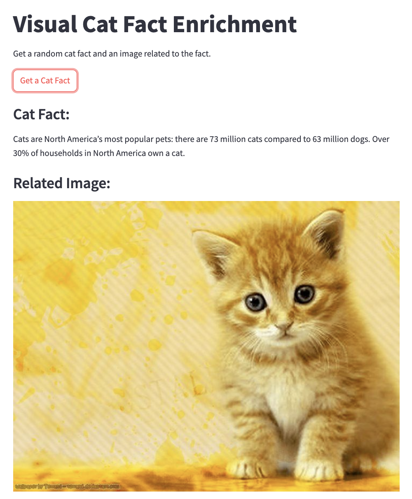
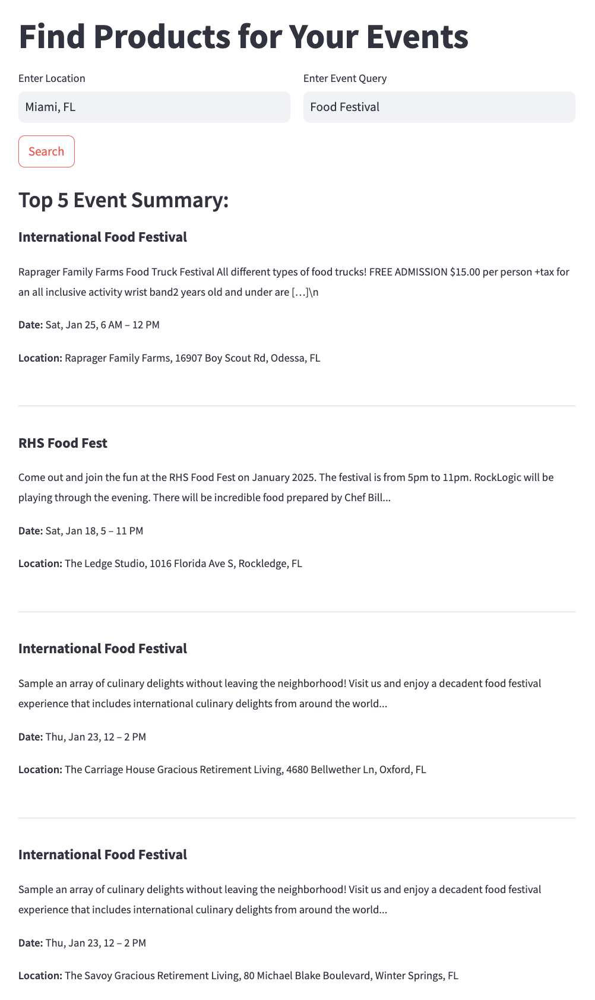

# AgenticAppBuilder

**A multi-agent workflow that lets you ideate and construct lightweight web applications, leveraging a curated set of public APIs, powered by Google Cloud Platform and Gemini.**


## Overview

AgenticAppBuilder is an agentic setup designed to dynamically create lightweight web (Streamlit) applications through multi-agent collaboration. Leveraging Google Cloud Platform (GCP) and Gemini's advanced generative AI capabilities, the tool can help you intelligently ideate, delegate tasks, and seamlessly integrate APIs to deliver rapid and efficient application development. The system includes a curated API library with preselected APIs and offers an extensible design that allows easy integration of additional APIs or extension of agent capabilities to suit specific needs.

<div align="center">
  
  <p><strong>Click on the image to enlarge</strong></p>
</div>

## Getting Started

#### Prerequisites

- **Python** 3.8 or higher

#### Getting API Keys

To utilize certain features, you'll need API keys from Gemini and SerpApi.

#### Gemini API Key

1. **Sign in to your Google Account**: Ensure you're logged in to your Google account.

2. **Access Google AI Studio**: Navigate to [Google AI Studio](https://ai.google.dev/aistudio).

3. **Obtain API Key**:
   - Click on the **"Gemini API"** tab.
   - Click the **"Get API Key in Google AI Studio"** button.
   - Review and accept the terms of service.
   - Choose to create the API key in a new or existing project.
   - Your API key will be generated; store it securely.

For detailed instructions, refer to [Google's official guide](https://ai.google.dev/gemini-api/docs/api-key).

#### SerpApi API Key

1. **Create an Account**: Sign up at [SerpApi](https://serpapi.com/users/sign_up).

2. **Access Dashboard**: After logging in, go to the [dashboard](https://serpapi.com/dashboard).

3. **Retrieve API Key**: Your private API key is displayed in the **"Your Private API Key"** section. Copy and store it securely.

For more information, visit [SerpApi's documentation](https://serpapi.com/search-api).

### Installation

1. **Clone the Repository**:
   ```bash
   git clone https://github.com/arunpshankar/AgenticAppBuilder.git
   cd AgenticAppBuilder
   ```

2. **Create and Activate a Virtual Environment**:
   - **Create**:
     ```bash
     python -m venv venv
     ```
   - **Activate**:
     - **Windows**:
       ```bash
       venv\Scripts\activate
       ```
     - **macOS and Linux**:
       ```bash
       source venv/bin/activate
       ```

3. **Upgrade pip**:
   ```bash
   pip install --upgrade pip
   ```

4. **Install Dependencies**:
   ```bash
   pip install -r requirements.txt
   ```

5. **Set Environment Variables**:
   ```bash
   export PYTHONDONTWRITEBYTECODE=1 PYTHONPATH=$PYTHONPATH:.
   ```

6. **Configure API Keys**:
   - Create a folder named `credentials` inside the cloned project:
     ```bash
     mkdir credentials
     ```
   - Inside the `credentials` folder, create a YAML file named `api.yml` with the following content:
     ```yaml
     GOOGLE_API_KEY: your_gemini_api_key
     SERP_API_KEY: your_serpapi_api_key
     ```
   Replace `your_gemini_api_key` and `your_serpapi_api_key` with the API keys you obtained earlier.

7. **Run the Application**:
   ```bash
   streamlit run src/workflow/app.py
   ```

By following these steps, you'll set up the AgenticAppBuilder project with the necessary configurations and API integrations. 


### User Interface Overview

#### Getting Started

The landing page provides an intuitive entry point to the system. Upon loading, all required APIs and their associated information are preloaded, ensuring a seamless user experience. 

- **API Registry:** APIs are represented as tools in the system, these are the building blocks of the applications.
- **"Ideate" Button:** Clicking this button randomly selects 3–4 APIs (tools) and triggers the **Ideation Agent**. This agent uses the selected APIs to brainstorm and generate ideas for potential applications.


#

#### Step 1: Ideation Process

Hitting the "Ideate" button initiates the ideation process, during which the system generates application ideas based on the selected APIs. These ideas are displayed dynamically in the section below. YOu can also ideate without any secltions - thte system will randomly select APIs.

**Note:** If the list of APIs is not visible, you can upload the CSV file to the `./data` folder and click the **Refresh Entries** button in the side panel, located below the **Ideate** button, to populate the table.

The Ideate agent will select 3–4 APIs per idea.



#

#### Step 2: Building Applications

Once ideas are displayed, users can select one or more ideas and click **"Build"**. This action launches the **Builder Agent**, which orchestrates the creation of the application. 

- The Builder Agent constructs both the frontend and backend of the application (using **Streamlit**), ensuring seamless integration between components.
- The agent is aware of the required API combinations and the sequence of operations necessary to build the application effectively.


Another example of the application-building process is shown below:


#

#### Step 3: Deploying Applications

Once built, the applications are deployed locally and appear in the side panel for easy access (shown above). They can also be opened in full-screen mode for a better experience.

To run the application locally:
```bash
streamlit run ./src/apps/<app_name>frontend.py
```

#

### Example Applications

Here’s a polished and clean version of the content for a README file:  

---

# Applications  

Below are examples of sample applications created by the Agentic system.

### **Cat Fact Enricher**  
This application fetches a random cat fact from the Cat Fact API and enriches it with a related image fetched via the SERP API. The response is returned as a combined dictionary containing both the fact and the image URL.  

  
**Internal Reference:** [./src/apps/visual_cat_fact_enrichment](./src/apps/visual_cat_fact_enrichment)  

---

### **Image Source Verification**  
This app fetches a random cat fact from the Cat Fact API and searches for a related image using the SERP API. It combines the results into a single, consolidated response.  

  
**Internal Reference:** [./src/apps/image_source_verification](./src/apps/image_source_verification)  

---

### **Local Business Investment Analyzer**  
This application orchestrates API calls to gather local business information, detailed business data, and financial data using SERP API endpoints. The results are structured into a cohesive and actionable response.  

  
**Internal Reference:** [./src/apps/local_business_investment](./src/apps/local_business_investment)  

---

### **Review Analyzer**  
The Review Analyzer performs product searches across various platforms, including Google Shopping, Walmart, Google Search, and Google Local, using the SERP API. It consolidates functionality into reusable methods, ensuring flexibility for multiple search engines.  

  
**Internal Reference:** [./src/apps/product_review_analyzer](./src/apps/product_review_analyzer)  

---

### **Products and Events**  
This application utilizes the SERP API to search for local events through the Google Events engine and related products via the Google Shopping engine. The results are formatted as a structured response with nested data.  

  
**Internal Reference:** [./src/apps/targeted_event_product_finder](./src/apps/targeted_event_product_finder)  

---

### How to Use  
- Clone this repository to your local system.  
- Navigate to the respective app directories mentioned in the **Internal References**.  
- Follow the instructions in the `README.md` file of each app directory for setup and usage.  

---

Each application is designed to demonstrate modularity, efficiency, and ease of integration, making them valuable tools for leveraging API capabilities in different contexts.  

--- 


#

## Contributing

Contributions are welcome! Please follow these steps:

1. Fork the repository.
2. Create a new branch: `git checkout -b feature-name`.
3. Commit your changes: `git commit -m 'Add new feature'`.
4. Push to the branch: `git push origin feature-name`.
5. Submit a pull request.

## License

This project is licensed under the MIT License - see the [LICENSE](LICENSE) file for details.

## Contact

For queries or collaborations, please contact [Your Name](mailto:arunpshankar@google.com).


